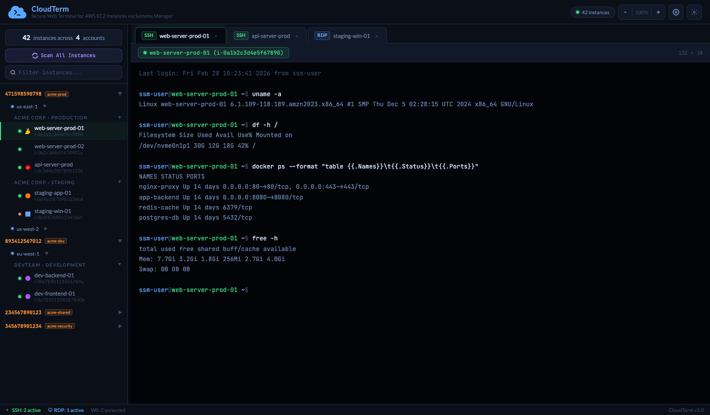
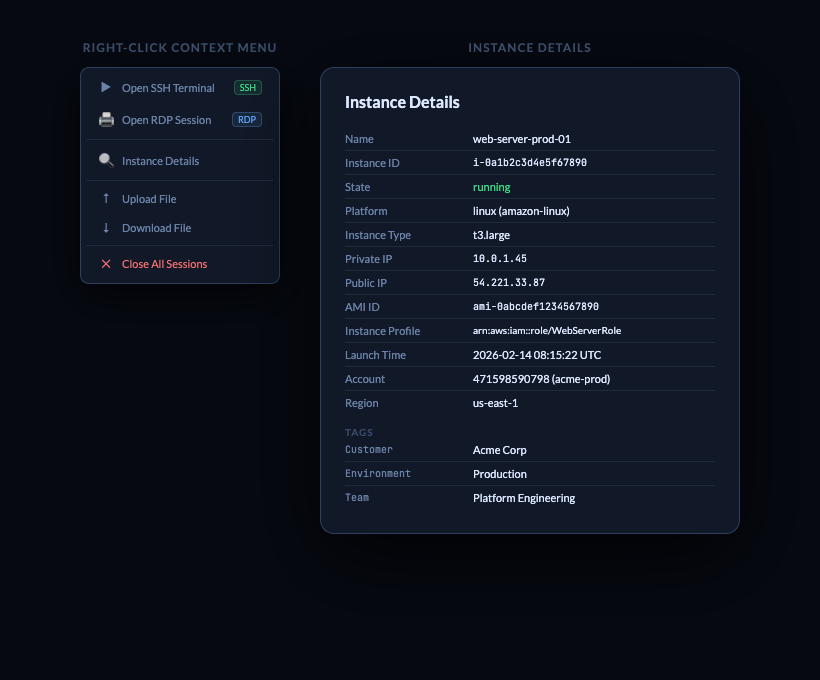

# CloudTerm

A secure, web-based terminal and RDP client for managing AWS EC2 instances via Systems Manager (SSM). Access your fleet from a browser — no SSH keys, no bastion hosts, no open ports.



## Features

### Multi-Account Instance Discovery
- Auto-discovers EC2 instances across multiple AWS profiles and regions concurrently
- Hierarchical sidebar: **Account > Region > Tag Group > Instance**
- Collapsible tree with inline search/filter
- Caches results to YAML with configurable TTL (default 30 min)
- Per-region refresh and full fleet re-scan from the UI

### SSH Terminal (Linux/macOS instances)
- Interactive terminal sessions via `aws ssm start-session` — no SSH keys needed
- Full xterm.js emulation with resize, scroll, Ctrl+C interrupt
- Multiple concurrent sessions as tabbed panels
- Zoom controls and configurable terminal font size
- Multiple terminal color themes (GitHub Dark, Nord, Dracula, Monokai, etc.)

### RDP (Windows instances)
- Browser-based RDP via Apache Guacamole integration
- SSM port forwarding — no public IPs or open RDP ports required
- Resolution selector and fullscreen mode
- RDP sessions appear as tabs alongside SSH sessions

### File Transfer
- **Upload** files to instances (drag-and-drop or file picker, no size limit)
- **Download** files from instances (no size limit)
- Supports both Linux (bash) and Windows (PowerShell)
- Real-time progress bar via NDJSON streaming
- Transfers use SSM SendCommand — no S3 buckets or agents needed

### Fleet Summary
- Dashboard showing total/running/stopped counts per account
- Platform breakdown (Amazon Linux, RHEL, Ubuntu, Windows, SUSE)
- Scan duration tracking

### Instance Details
- Right-click context menu on any instance
- Detailed view: name, ID, IPs, state, platform, instance type, AMI ID, IAM instance profile, launch time, and all tags



### UI Themes
- **App themes**: Dark (default), Nord, Dracula, Light
- **Terminal themes**: GitHub Dark, Atom One Dark, Nord, Dracula, Solarized Dark, Monokai

## Architecture

```
┌─────────────────────────────────────────────────────────┐
│                     Browser                             │
│   xterm.js terminals  │  Guacamole RDP  │  File I/O     │
└────────────┬──────────┴────────┬────────┴──────┬────────┘
             │ WebSocket         │ WebSocket      │ HTTP
             ▼                   ▼                ▼
┌────────────────────┐  ┌──────────────┐  ┌──────────────┐
│    CloudTerm (Go)  │  │  guac-lite   │  │  CloudTerm   │
│    Port 5000       │  │  (Node.js)   │  │  /upload     │
│                    │  │  Port 8080   │  │  /download   │
│  - EC2 Discovery   │  └──────┬───────┘  └──────────────┘
│  - SSM Sessions    │         │
│  - File Transfer   │         ▼
│  - REST API        │  ┌──────────────┐
└────────┬───────────┘  │    guacd     │
         │              │  Port 4822   │
         ▼              └──────────────┘
┌────────────────────┐
│  SSM Forwarder     │
│  (Go) Port 5001    │
│  - RDP tunnels     │
│  - Port allocation │
└────────────────────┘
         │
         ▼
    AWS SSM / EC2
```

**Services:**
| Service | Role | Base Image |
|---------|------|------------|
| `cloudterm` | Main web app, terminal sessions, API | amazonlinux:2023 + AWS CLI |
| `ssm-forwarder` | RDP port forwarding via SSM + socat | amazonlinux:2023 + AWS CLI |
| `guac-lite` | Guacamole WebSocket proxy | Node.js 18 Alpine |
| `guacd` | Apache Guacamole daemon | guacamole/guacd |

## Prerequisites

- **Docker** and **Docker Compose**
- **AWS credentials** configured in `~/.aws/` (profiles)
- EC2 instances must have the **SSM Agent** installed and an appropriate **IAM instance profile**

## Quick Start

```bash
# Clone the repository
git clone https://github.com/subbareddyalamur/cloudterm-go.git
cd cloudterm-go

# Start all services
docker compose up -d

# Open in browser
open http://localhost:5000
```

CloudTerm automatically discovers instances across all configured AWS profiles on startup.

## Configuration

All configuration is via environment variables (set in `docker-compose.yml` or shell):

| Variable | Default | Description |
|----------|---------|-------------|
| `PORT` | `5000` | Web server port |
| `TAG1` | `App` | Primary tag for grouping instances |
| `TAG2` | `Environment` | Secondary tag for grouping instances |
| `RDP_MODE` | `native` | RDP mode: `native` or `guacamole` |
| `GUAC_WS_URL` | `ws://localhost:8080` | Guacamole WebSocket URL |
| `GUAC_CRYPT_SECRET` | — | 32-byte AES key for Guacamole tokens |
| `SSM_FORWARDER_HOST` | `ssm-forwarder` | Forwarder service hostname |
| `SSM_FORWARDER_PORT` | `5001` | Forwarder service port |
| `INSTANCES_FILE` | `instances_list.yaml` | Path to cache discovered instances |
| `CACHE_TTL_SECONDS` | `1800` | Instance cache TTL (seconds) |
| `PORT_RANGE_START` | `33890` | Start of port range for RDP tunnels |
| `PORT_RANGE_END` | `33999` | End of port range for RDP tunnels |
| `DEBUG` | `false` | Enable debug logging |

## Project Structure

```
cloudterm-go/
├── cmd/
│   ├── cloudterm/main.go          # Main app entry point
│   └── forwarder/main.go          # RDP forwarder entry point
├── internal/
│   ├── aws/
│   │   ├── discovery.go           # EC2 discovery, scanning, caching
│   │   └── filetransfer.go        # File upload/download via SSM
│   ├── config/config.go           # Environment variable config
│   ├── guacamole/token.go         # Guacamole token encryption (AES-256-CBC)
│   ├── handlers/handlers.go       # HTTP + WebSocket handlers
│   ├── session/manager.go         # Terminal session lifecycle (PTY)
│   └── types/types.go             # Shared data structures
├── web/
│   ├── static/
│   │   ├── js/app.js              # Frontend application
│   │   └── vendor/                # xterm.js, guacamole-common.js
│   └── templates/
│       ├── index.html             # Main UI
│       └── rdp-client.html        # RDP client page
├── docker/
│   └── guac-lite/                 # Guacamole-Lite server (Node.js)
├── Dockerfile                     # Main app container
├── Dockerfile.forwarder           # Forwarder container
└── docker-compose.yml             # Full stack orchestration
```

## AWS Services Used

| Service | Purpose |
|---------|---------|
| **EC2** | `DescribeInstances` for discovery |
| **SSM** | `StartSession` for terminals, `SendCommand` for file transfer |
| **STS** | `GetCallerIdentity` for account ID resolution |
| **IAM** | `ListAccountAliases` for account alias lookup |

## Required IAM Permissions

The AWS profiles used by CloudTerm need the following permissions:

```json
{
  "Version": "2012-10-17",
  "Statement": [
    {
      "Effect": "Allow",
      "Action": [
        "ec2:DescribeInstances",
        "ec2:DescribeRegions",
        "ssm:StartSession",
        "ssm:TerminateSession",
        "ssm:SendCommand",
        "ssm:GetCommandInvocation",
        "sts:GetCallerIdentity",
        "iam:ListAccountAliases"
      ],
      "Resource": "*"
    }
  ]
}
```

EC2 instances must have an IAM instance profile with the `AmazonSSMManagedInstanceCore` managed policy (or equivalent).

## Tech Stack

- **Backend**: Go 1.24, AWS SDK v2, Gorilla WebSocket, creack/pty
- **Frontend**: Vanilla JS, xterm.js, guacamole-common.js
- **Containers**: Docker with multi-stage builds on amazonlinux:2023
- **RDP Proxy**: Apache Guacamole (guacd + guacamole-lite)

## Security Notes

- All instance access goes through AWS SSM — no SSH keys, no open ports
- AWS credentials are mounted read-only from the host
- Guacamole tokens are encrypted with AES-256-CBC
- File transfers are chunked via SSM with timeouts that scale with file size
- Each terminal session runs in an isolated PTY with its own process group

## License

MIT
