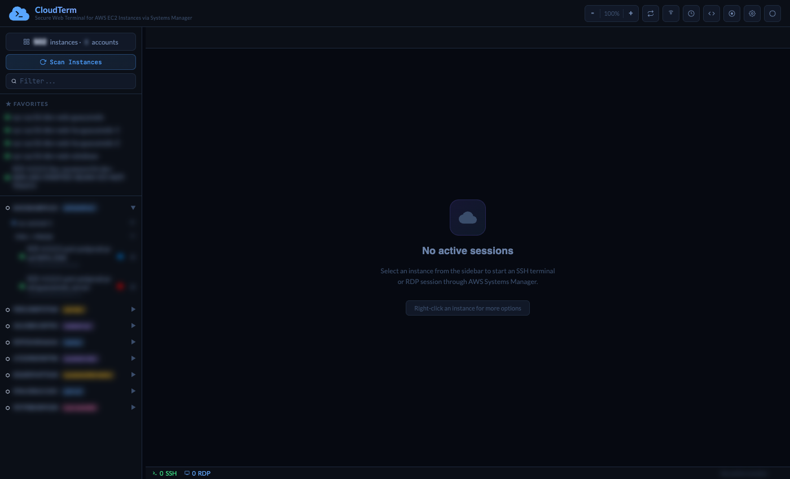
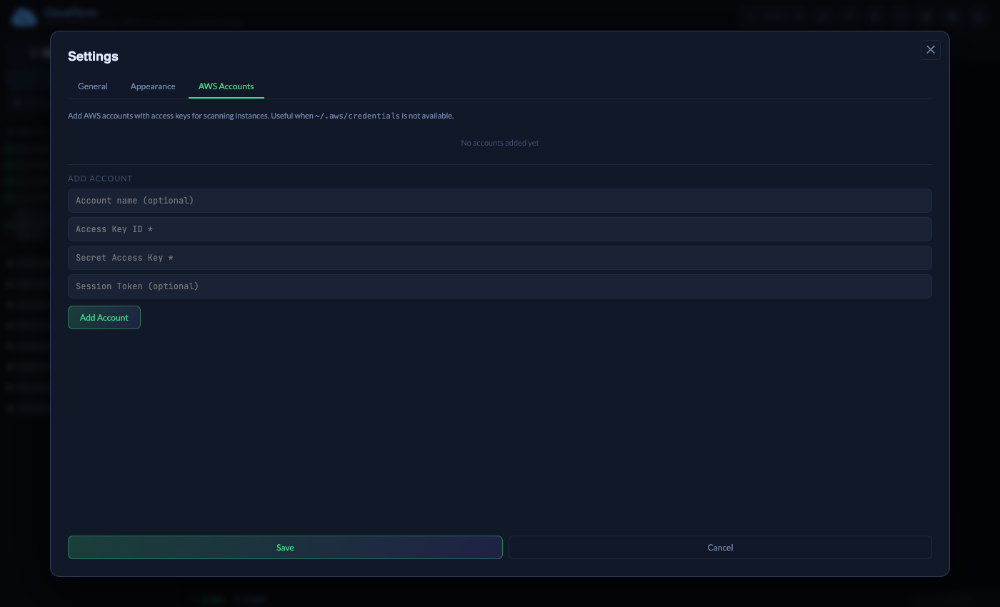
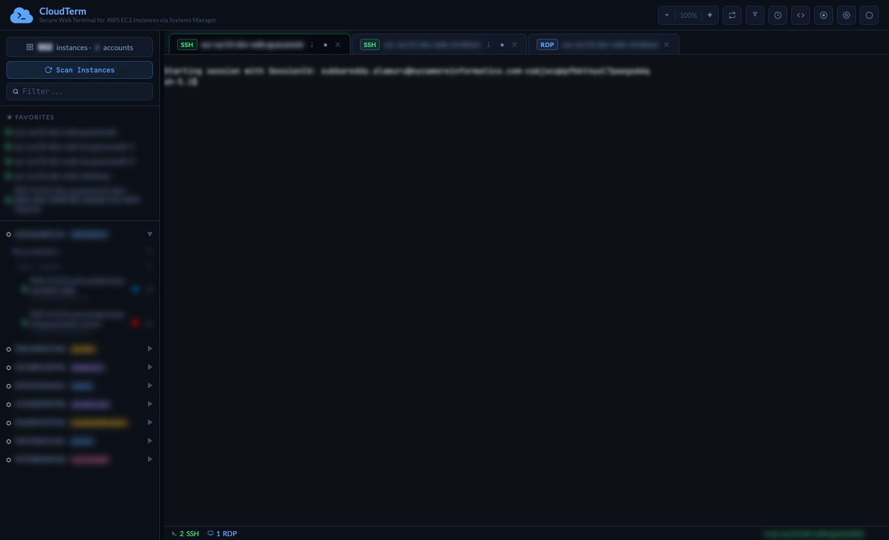
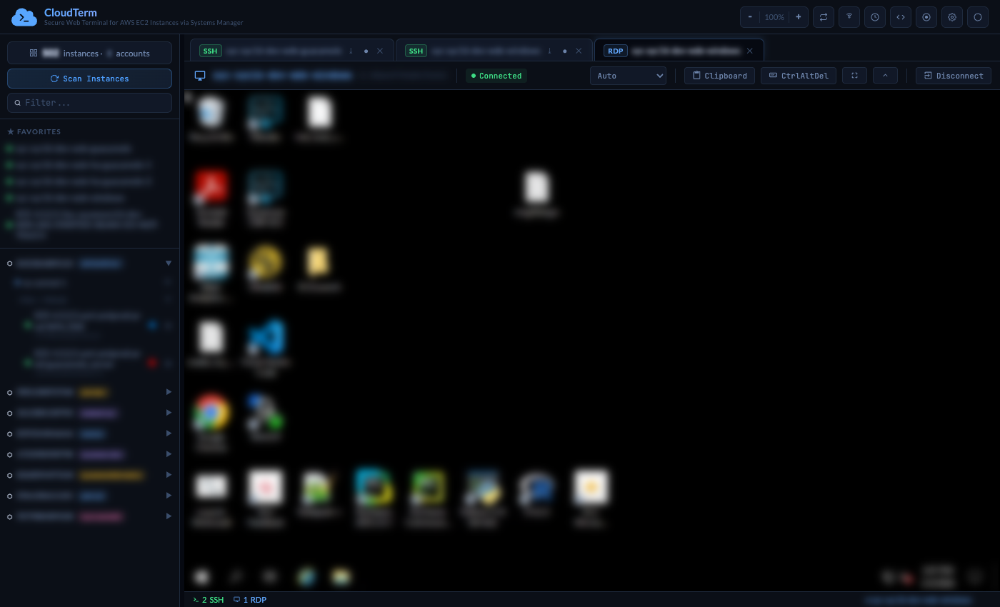
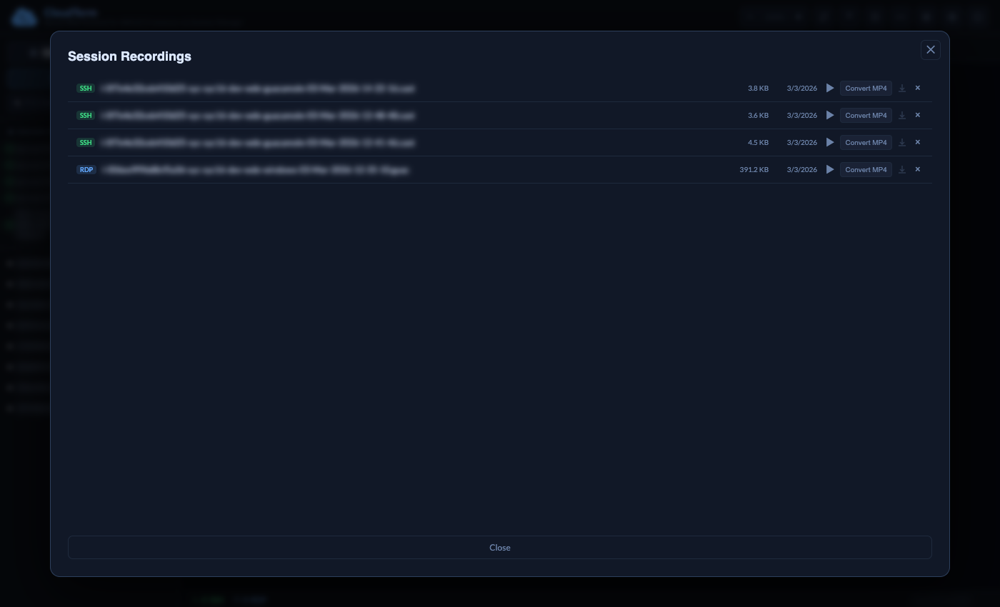
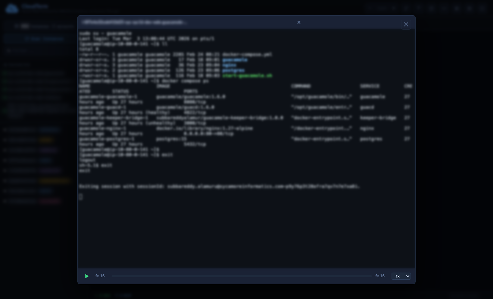
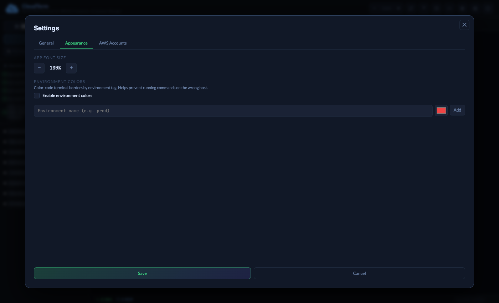
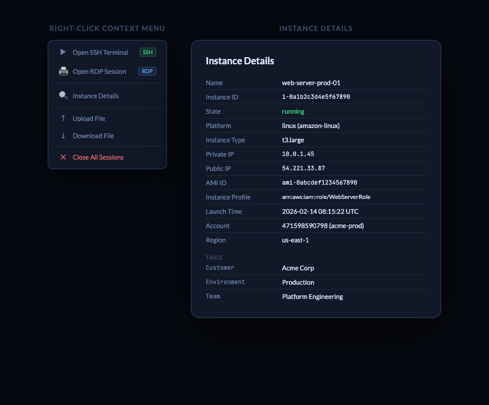

# CloudTerm

A secure, web-based terminal and RDP client for managing AWS EC2 instances via Systems Manager (SSM). Access your fleet from a browser — no SSH keys, no bastion hosts, no open ports.



## Features

### Multi-Account Instance Discovery
- Auto-discovers EC2 instances across multiple AWS profiles and regions concurrently
- Hierarchical sidebar: **Account > Region > Tag Group > Instance**
- Collapsible tree with inline search/filter
- Caches results to YAML with configurable TTL (default 30 min)
- Per-region refresh and full fleet re-scan from the UI

### Manual AWS Accounts
- Add AWS accounts with access key, secret key, and optional session token
- Supports cross-account access without requiring local AWS profile configuration
- Instances from manual accounts appear alongside profile-based accounts in the sidebar
- Credentials passed securely via environment variables (never written to disk)



### SSH Terminal (Linux/macOS instances)
- Interactive terminal sessions via `aws ssm start-session` — no SSH keys needed
- Full xterm.js emulation with resize, scroll, Ctrl+C interrupt
- Multiple concurrent sessions as tabbed panels
- **Terminal title bar** with action buttons: Suggest, Details, Export, Record, Split, Fullscreen, End
- Zoom controls and configurable terminal font size
- Multiple terminal color themes (GitHub Dark, Nord, Dracula, Monokai, Catppuccin, Railway, Replit, Raycast, Unify, etc.)
- **Multi-term sidebar search**: type space-separated terms (e.g., `syc23 windows`) to filter instances matching ALL terms



### RDP (Windows instances)
- Browser-based RDP via Apache Guacamole integration
- SSM port forwarding — no public IPs or open RDP ports required
- Resolution selector and fullscreen mode
- **Clipboard sync**: Cmd+C/V/X (Mac) and Ctrl+C/V/X (Windows/Linux) work seamlessly between host and remote
- Mac Cmd-to-Ctrl key remapping (Cmd+C/V/A work as Ctrl+C/V/A in Windows)
- Local clipboard auto-synced to remote on focus/click — paste works on first try
- Remote clipboard auto-copied to local system clipboard via postMessage bridge
- Auto-reconnect on transient connection drops with exponential backoff
- RDP sessions appear as tabs alongside SSH sessions
- **Credential Vault**: auto-connect with saved credentials (see below)



### Session Recording & Playback
- **SSH recording**: Toggle recording from the terminal title bar — captures terminal output in `.cast` (asciicast v2) format
- **RDP recording**: Server-side recording of Guacamole sessions in `.guac` format
- **Recordings browser**: List, play, convert, download, and delete recordings from a dedicated modal
- **Recording toggle**: Click the record button in the status bar to start/stop — synced with server state
- Recording status indicator in the status bar with elapsed time



### Asciinema-Style .cast Player
- Built-in terminal replay player with video-player-style controls
- **Idle time capping**: Long pauses compressed to 2 seconds for efficient playback
- **Interactive scrubber**: Click to seek, hover for time tooltip, draggable thumb
- **Keyboard shortcuts**: Space (play/pause), Left/Right arrows (seek ±5s)
- **Speed control**: 0.5x, 1x, 2x, 5x, 10x playback speed
- **Auto-play**: Recordings start playing immediately on open



### Guacamole RDP Replay
- Play back `.guac` RDP recordings directly in the browser
- Uses Guacamole's `SessionRecording` player with seek and playback controls
- Full resolution playback matching the original recording

### MP4 Conversion & Download
- Convert `.cast` (SSH) and `.guac` (RDP) recordings to MP4 video
- **SSH pipeline**: `.cast` → `agg` → `.gif` → `ffmpeg` → `.mp4`
- **RDP pipeline**: `.guac` → `guacenc` → `.m4v` → `ffmpeg` → `.mp4`
- Runs in a dedicated converter sidecar container (no CPU impact on main app)
- Async job queue with polling — convert and download independently
- Separate "Convert MP4" and "Download" buttons with status tracking


### Terminal Log Export
- Export full SSH session output as a clean text file
- ANSI escape codes stripped, line endings normalized
- Download from the session context menu

### Terminal Theming per Environment
- Auto-color terminal borders by environment tag (e.g., red for production, green for dev)
- Visual safety net against running commands on the wrong host
- Fully configurable in Settings > Appearance
- Map any environment name to any color
- User-optional — disabled by default



### Port Forwarding
- Forward any remote port through SSM to localhost
- **Active tunnels panel**: Shows all running tunnels with local/remote port mapping
- **Open in browser**: One-click button for web ports (3000, 8080, etc.) opens `localhost:{port}` in a new tab
- Multiple concurrent tunnels per instance
- Auto-cleanup when tunnels are stopped


### File Transfer
- **Upload** files to instances (drag-and-drop or file picker, no size limit)
- **Download** files from instances (no size limit)
- Supports both Linux (bash) and Windows (PowerShell)
- Real-time progress via NDJSON streaming in a non-blocking Transfer Manager panel
- Transfers use SSM SendCommand — no S3 buckets or agents needed
- **Transfer Manager**: Google Drive-style progress panel in the bottom-right corner — modals close immediately and transfers run in the background with stacked progress rows

### Express Transfer (S3)
- **Express Upload**: Local → S3 → EC2 instance via presigned GET URL
- **Express Download**: EC2 instance → S3 → Local via presigned PUT URL
- Significantly faster than SSM-based chunking for large files
- EC2 instances download/upload using `curl` (Linux) or `Invoke-WebRequest` (Windows) — no AWS CLI needed
- S3 bucket name configurable in Settings (persisted in browser localStorage)
- Express Download button also available in the File Browser alongside the regular download
- S3 objects are deleted immediately after transfer completes

### Remote File Browser
- Visual directory navigator for remote instances
- Breadcrumb path navigation with click-to-navigate
- Lists files with size, permissions, and modification time
- Click a folder to browse into it, click a file to download
- Regular and Express Download buttons per file (express shown when S3 is configured)
- Upload to the currently browsed directory
- Works on both Linux and Windows instances

### Broadcast Commands
- Run the same command across multiple instances simultaneously
- Instance selection with search/filter and Select All / Deselect All
- Concurrent SSM execution with semaphore (limit 10 parallel)
- Per-instance results with success/error badges and output display
- Accessible from the toolbar or the instance context menu

### Saved Command Snippets
- Quick-access library of reusable commands
- Seeded with common defaults (df, free, top, uptime, ss, systemctl)
- Add, edit, delete, and organize custom snippets
- One-click insert into the active SSH terminal
- Export/import as JSON for sharing across setups

### Session History & Audit Log
- Tracks all session activity: SSH start/stop, RDP connections, file transfers, broadcasts
- JSON-lines format (`audit.log`) for easy parsing
- History modal with searchable, paginated event list
- Each event shows action, instance, timestamp, and details

### Instance Quick Metrics
- CPU load and core count
- Memory usage (used/total with percentage)
- Disk usage (used/total with percentage)
- System uptime
- Color-coded gauge bars (green < 70%, orange 70-90%, red > 90%)
- Works on both Linux and Windows

### Favorites / Pinned Instances
- Star frequently-used instances for quick access
- Dedicated favorites section at the top of the sidebar
- One-click to connect, persisted across sessions
- Toggle from the context menu or directly in the sidebar

### AI Assistant
- Context-aware AI chat panel for AWS operations and diagnostics
- **Multi-provider support**: AWS Bedrock (default), Anthropic, OpenAI, Google Gemini, and local Ollama
- AI has full awareness of your fleet — all instances, IPs, states, and the active session
- **Tool use**: AI can query security groups, NACLs, route tables, load balancers, and instance details autonomously
- **Run commands on instances**: AI proposes commands, you approve or reject before execution — output is captured and fed back to the AI for follow-up analysis
- **Safety guardrails**: destructive commands (`rm -rf`, `shutdown`, `reboot`, `drop database`, etc.) are detected and blocked in both frontend and backend
- Streaming responses via Server-Sent Events with markdown rendering
- Conversation history maintained per session
- Configurable model, temperature, and max tokens via environment variables or Settings UI

### Terminal Intelligence Engine
- **Embedded, self-learning** autocomplete and error analysis — no external model or API required
- **Ghost text suggestions**: dim inline text appears as you type, like fish shell
  - **Tab**: accept full suggestion
  - **Right Arrow**: accept word-by-word (at end of line)
  - **Escape**: dismiss suggestion
  - Tab passes through to shell completion when no suggestion is visible
- **Trie prefix tree**: instant command lookup from bootstrap corpus (~190 common Linux/AWS/Docker/K8s commands)
- **Frecency scoring**: frequency × recency ranking with 1-week half-life — frequently used commands surface first
- **Micro neural network**: 47-parameter MLP (mcfly-style) for contextual re-ranking based on exit code, directory, environment, and usage patterns
- **Error detection**: 20 built-in regex patterns (permission denied, command not found, disk full, OOM, etc.) + TF-IDF cosine similarity for learned patterns
- **Self-learning**: every command is recorded; n-gram model and frecency scores update automatically; error resolutions are learned
- **Per-session toggle**: Suggest button in terminal title bar to enable/disable
- **Encrypted storage**: command history and learned patterns stored in bbolt with AES-256-GCM encryption at rest
- **Log insight toasts**: non-intrusive notifications when errors are detected, with suggested fixes
- **Zero external dependencies**: pure Go engine, ships inside Docker, ~2MB binary overhead

### RDP Credential Vault
- **Encrypted password vault** for RDP session credentials
- **Auto-connect**: when connecting to an RDP instance, the vault checks for matching credentials and connects immediately — no modal prompt
- **Match hierarchy** (checked in priority order):
  1. **Exact instance ID**: credential saved for a specific instance
  2. **Name substring**: matches any instance whose name contains the substring (e.g., `windows`)
  3. **Name pattern**: glob matching (e.g., `*-windows-*`)
  4. **Environment**: matches all instances in an environment tag (e.g., `dev`)
  5. **Account**: matches all instances in an AWS account
  6. **Global**: fallback for all instances
- **Save to Vault** checkbox in the RDP credential modal — pick a match rule, label it, and save
- **Vault Management UI** in Settings → Credential Vault: view, delete saved credentials with colored type badges
- **AES-256-GCM encryption** at rest — passwords never sent to frontend (backend resolves vault ID → real password → Guacamole)
- **bbolt storage**: single file, pure Go, no external database

### Network Topology Map
- Interactive D3.js visualization of your entire VPC architecture
- **Resource coverage**: VPC, subnets, instances, security groups, NACLs, route tables, internet gateways, NAT gateways, transit gateway attachments, VPC peerings, VPC endpoints, load balancers, Elastic IPs, DHCP options, flow logs, and prefix lists
- Layout grouped by Availability Zone with subnets, instances, and networking components
- Zoom, pan, and search with auto-focus on matched resources
- Click any resource for a detail panel showing full metadata and rules

### Network Reachability Analyzer
- **Interactive path analysis**: click a source instance, click a destination (or enter an IP), pick protocol/port, and analyze
- **Local rule-based analysis**: traces traffic through SG outbound → NACL outbound → route table → NACL inbound → SG inbound (5-hop forward + 2-hop return path)
- **AWS Network Insights integration**: real packet-path simulation using `CreateNetworkInsightsPath` / `StartNetworkInsightsAnalysis` for accurate deep analysis
- Real-time SSE streaming of hop-by-hop results as analysis progresses
- **Exposure scan**: identifies internet-exposed instances and ports with severity ratings
- **Rule conflict detection**: flags overly permissive rules, redundant SG rules, shadowed NACL rules, and missing ephemeral port allowances

### Fleet Summary
- Dashboard showing total/running/stopped counts per account
- Platform breakdown (Amazon Linux, RHEL, Ubuntu, Windows, SUSE)
- Scan duration tracking

### Instance Details
- **Terminal title bar button**: Click "Details" on any active session to view full instance info
- **Live API fetch**: Calls `DescribeInstances` + `DescribeSecurityGroups` + `DescribeVolumes` for real-time data
- **Full-screen modal** with organized sections:
  - **Instance**: Name, ID, type, architecture, key pair, IAM profile, AMI, launch time, virtualization, ENA, EBS-optimized
  - **Network**: VPC, subnet, AZ, tenancy, private/public IP, private/public DNS
  - **Network Interfaces**: ENI ID, subnet, IPs, MAC, status
  - **Storage**: EBS volumes with device name, size, type, IOPS, encryption status, KMS key (inline)
  - **Security Groups**: Card layout with inbound/outbound rules **side by side**, showing protocol:port, source CIDR/SG, description
  - **Tags**: Full tag listing in 2-column grid
  - **Quick Metrics**: Load-on-demand CPU/memory/disk gauges



### Settings
- **Vertical tab sidebar** (Claude.ai-style layout) with section titles and descriptions
- **General**: S3 bucket for Express Transfers, auto-recording toggle, terminal suggestions toggle, error analysis toggle
- **Appearance**: App font size (zoom), environment color mapping with custom color picker
- **AWS Accounts**: Add/remove manual AWS accounts with access keys
- **AI Agent**: Multi-provider config (Bedrock, Anthropic, OpenAI, Gemini, Ollama) with model, temperature, max tokens
- **Credential Vault**: View and manage saved RDP credentials with delete and refresh
- Settings modal: `90vw × max 900px` with clean section dividers
- Preferences synced to server and persisted across sessions

### UI Themes
- **App themes**: Dark (default), Nord, Dracula, Cyberpunk, Warp Hero, Light, Railway, Replit, Raycast, Unify
- **Terminal themes**: GitHub Dark, Atom One Dark, Nord, Dracula, Solarized Dark, Monokai, Catppuccin Mocha, Warp, Railway, Replit, Raycast, Unify

## Architecture

```
+----------------------------------------------------------------------+
|                            Browser                                   |
|  xterm.js terminals | Guacamole RDP | File I/O | AI Chat | Topology |
+----------+-----------+-------+-------+------+-------+-------+-------+
           | WebSocket         | WebSocket     | HTTP / SSE
           v                   v               v
+--------------------+  +--------------+  +----------------------+
|  CloudTerm (Go)    |  |  guac-lite   |  |  CloudTerm           |
|  Port 5000         |  |  (Node.js)   |  |  /upload  /download  |
|                    |  |  Port 8080   |  |  /ai-agent/chat      |
|  - EC2 Discovery   |  +------+-------+  |  /topology           |
|  - SSM Sessions    |         |          +----------------------+
|  - File Transfer   |         v
|  - Broadcast       |  +--------------+
|  - AI Assistant    |  |    guacd     |
|  - Topology API    |  |  Port 4822   |
|  - Audit Log       |  +--------------+
|  - Recordings API  |
|  - REST API        |
+--------+-----------+
         |                +-----------------+
         v                |  Converter      |
+--------------------+    |  Port 5002      |
|  SSM Forwarder     |    |  guacenc + agg  |
|  (Go) Port 5001    |    |  + ffmpeg       |
|  - RDP tunnels     |    +-----------------+
|  - Port forwards   |
|  - Port allocation |
+--------------------+
         |
         v
  AWS SSM / EC2 / VPC / Bedrock
```

**Services:**

| Service | Role | Base Image |
|---------|------|------------|
| `cloudterm` | Main web app, terminal sessions, API | amazonlinux:2023 + AWS CLI |
| `ssm-forwarder` | RDP + port forwarding via SSM + socat | amazonlinux:2023 + AWS CLI |
| `guac-lite` | Guacamole WebSocket proxy | Node.js 18 Alpine |
| `guacd` | Apache Guacamole daemon | guacamole/guacd |
| `converter` | Recording → MP4 conversion (guacenc, agg, ffmpeg) | debian:bookworm-slim |

## Prerequisites

- **Docker** and **Docker Compose**
- **AWS credentials** configured in `~/.aws/` (profiles with `credentials` and/or `config`)
- EC2 instances must have the **SSM Agent** installed and an appropriate **IAM instance profile**

## Quick Start

```bash
# Clone the repository
git clone https://github.com/subbareddyalamur/cloudterm.git
cd cloudterm

# Create data directories (container runs as non-root)
mkdir -p .cache .sessionrecordings .terminalexport .suggestdata

# Start all services
docker compose up -d

# Open in browser
open http://localhost:5000
```

CloudTerm automatically discovers instances across all configured AWS profiles on startup.

## Configuration

All configuration is via environment variables (set in `docker-compose.yml` or shell):

| Variable | Default | Description |
|----------|---------|-------------|
| `PORT` | `5000` | Web server port |
| `TAG1` | `App` | Primary tag for grouping instances in sidebar |
| `TAG2` | `Environment` | Secondary tag for grouping instances |
| `RDP_MODE` | `native` | RDP mode: `native` (local client) or `guacamole` (browser) |
| `GUAC_WS_URL` | `ws://localhost:8080` | Guacamole WebSocket URL |
| `GUAC_CRYPT_SECRET` | — | 32-byte AES key for Guacamole token encryption |
| `SSM_FORWARDER_HOST` | `ssm-forwarder` | Forwarder service hostname |
| `SSM_FORWARDER_PORT` | `5001` | Forwarder service port |
| `INSTANCES_FILE` | `instances_list.yaml` | Cached instance data filename |
| `CACHE_TTL_SECONDS` | `1800` | Instance cache TTL (seconds) |
| `PORT_RANGE_START` | `33890` | Start of dynamic port range for tunnels |
| `PORT_RANGE_END` | `33999` | End of dynamic port range |
| `AUDIT_LOG_FILE` | `audit.log` | Audit log filename |
| `PREFERENCES_FILE` | `preferences.json` | User preferences filename |
| `SESSION_RECORDING_DIR` | `.sessionrecordings` | Directory for session recordings |
| `TERMINAL_EXPORT_DIR` | `.terminalexport` | Directory for exported terminal logs |
| `AUTO_RECORD` | `false` | Auto-start recording on new sessions |
| `AWS_ACCOUNTS_FILE` | `aws_accounts.json` | Manual AWS accounts storage |
| `AI_PROVIDER` | `bedrock` | AI provider: `bedrock`, `anthropic`, `openai`, `gemini`, `ollama` |
| `AI_MODEL` | — | Model identifier (e.g., `anthropic.claude-3-sonnet-20240229-v1:0`) |
| `AI_MAX_TOKENS` | `4096` | Max response tokens |
| `AI_TEMPERATURE` | `0.3` | Sampling temperature |
| `AI_BEDROCK_REGION` | — | AWS region for Bedrock |
| `AI_BEDROCK_PROFILE` | — | AWS profile for Bedrock |
| `AI_ANTHROPIC_KEY` | — | Anthropic API key (if provider is `anthropic`) |
| `AI_OPENAI_KEY` | — | OpenAI API key (if provider is `openai`) |
| `AI_GEMINI_KEY` | — | Gemini API key (if provider is `gemini`) |
| `AI_OLLAMA_URL` | `http://localhost:11434` | Ollama server URL (if provider is `ollama`) |
| `SUGGEST_ENABLED` | `true` | Enable terminal autocomplete and suggestion engine |
| `SUGGEST_DATA_DIR` | `/app/suggestdata` | Directory for suggestion engine data (bbolt DB, learned models) |
| `SUGGEST_ENCRYPTION_KEY` | — | AES-256 encryption key for suggestion data and vault (auto-generated if empty) |
| `DEBUG` | `false` | Enable debug logging |

## Project Structure

```
cloudterm/
├── cmd/
│   ├── cloudterm/main.go              # Main app entry point
│   └── forwarder/main.go             # Port forwarder entry point
├── internal/
│   ├── audit/logger.go               # Session audit logging (JSON lines)
│   ├── aws/
│   │   ├── accounts.go               # Manual AWS account management
│   │   ├── discovery.go              # EC2 discovery, scanning, caching
│   │   ├── filetransfer.go           # File upload/download via SSM
│   │   ├── s3transfer.go             # Express file transfer via S3 presigned URLs
│   │   ├── filebrowser.go            # Remote directory browsing via SSM
│   │   ├── broadcast.go              # Multi-instance command execution
│   │   ├── metrics.go                # Instance CPU/memory/disk metrics
│   │   ├── topology.go               # VPC topology fetching (16+ AWS APIs)
│   │   ├── reachability.go           # Local reachability analysis & exposure scan
│   │   ├── network_insights.go       # AWS Network Insights deep analysis
│   │   └── networking.go             # Network utility functions
│   ├── config/config.go              # Environment variable config
│   ├── crypto/aes.go                 # AES-256-GCM encryption helpers (shared)
│   ├── guacamole/token.go            # Guacamole token encryption (AES-256-CBC)
│   ├── handlers/
│   │   ├── handlers.go               # HTTP + WebSocket handlers
│   │   └── topology.go               # Topology & reachability endpoints
│   ├── llm/
│   │   ├── provider.go               # LLM provider interface & types
│   │   ├── bedrock.go                # AWS Bedrock provider
│   │   ├── anthropic.go              # Anthropic API provider
│   │   ├── openai.go                 # OpenAI API provider
│   │   ├── gemini.go                 # Google Gemini provider
│   │   ├── ollama.go                 # Local Ollama provider
│   │   ├── factory.go                # Provider factory
│   │   ├── agent.go                  # System prompts & instance context
│   │   ├── tools.go                  # AI tool definitions
│   │   └── safety.go                 # Destructive command patterns
│   ├── session/
│   │   ├── manager.go                # Terminal session lifecycle (PTY)
│   │   └── recorder.go               # Session recording (.cast format)
│   ├── suggest/
│   │   ├── engine.go                 # Suggestion engine orchestrator
│   │   ├── trie.go                   # Compressed radix trie (prefix lookup)
│   │   ├── frecency.go              # Frequency × recency scorer
│   │   ├── mlp.go                   # 47-param micro neural network
│   │   ├── store.go                 # bbolt encrypted KV storage
│   │   ├── errorkb.go              # Error pattern detection + TF-IDF
│   │   ├── observer.go             # Non-blocking terminal I/O observer
│   │   ├── ansistrip.go            # ANSI escape sequence stripper
│   │   ├── bootstrap.go            # Bootstrap command corpus loader
│   │   └── data/                   # Embedded JSON data (commands, error patterns)
│   ├── vault/
│   │   └── store.go                 # RDP credential vault (bbolt + AES-GCM)
│   └── types/types.go                # Shared data structures
├── web/
│   ├── static/
│   │   ├── js/
│   │   │   ├── app.js                # Frontend application + AI chat
│   │   │   └── topology.js           # D3.js topology visualization
│   │   └── vendor/                   # xterm.js, guacamole-common.js, d3.js
│   └── templates/
│       ├── index.html                # Main UI
│       └── rdp-client.html           # RDP client page
├── docker/
│   ├── converter/                    # MP4 converter sidecar
│   │   ├── Dockerfile                # guacenc + agg + ffmpeg
│   │   └── api.py                    # Conversion REST API
│   └── guac-lite/                    # Guacamole-Lite server (Node.js)
├── Dockerfile                        # Main app container
├── Dockerfile.forwarder              # Forwarder container
└── docker-compose.yml                # Full stack orchestration
```

## AWS Services Used

| Service | Purpose |
|---------|---------|
| **EC2** | `DescribeInstances` for discovery; `DescribeVpcs`, `DescribeSubnets`, `DescribeSecurityGroups`, `DescribeNetworkAcls`, `DescribeRouteTables`, `DescribeInternetGateways`, `DescribeNatGateways`, `DescribeTransitGatewayAttachments`, `DescribeVpcPeeringConnections`, `DescribeVpcEndpoints`, `DescribeAddresses`, `DescribeDhcpOptions`, `DescribeFlowLogs`, `DescribeManagedPrefixLists` for topology; `CreateNetworkInsightsPath`, `StartNetworkInsightsAnalysis`, `GetNetworkInsightsAnalysis` for reachability |
| **ELB** | `DescribeLoadBalancers`, `DescribeListeners`, `DescribeTargetGroups`, `DescribeTargetHealth` for topology |
| **SSM** | `StartSession` for terminals, `SendCommand` for file transfer, broadcast, and metrics |
| **S3** | `PutObject`, `GetObject`, `DeleteObject` for Express Transfers (optional, only when S3 bucket is configured) |
| **Bedrock** | `ConverseStream` for AI assistant (optional, configurable provider) |
| **STS** | `GetCallerIdentity` for account ID resolution |
| **IAM** | `ListAccountAliases` for account alias lookup |

## Required IAM Permissions

The AWS profiles used by CloudTerm need the following permissions:

```json
{
  "Version": "2012-10-17",
  "Statement": [
    {
      "Effect": "Allow",
      "Action": [
        "ec2:DescribeInstances",
        "ec2:DescribeRegions",
        "ec2:DescribeVpcs",
        "ec2:DescribeSubnets",
        "ec2:DescribeSecurityGroups",
        "ec2:DescribeNetworkAcls",
        "ec2:DescribeRouteTables",
        "ec2:DescribeInternetGateways",
        "ec2:DescribeNatGateways",
        "ec2:DescribeTransitGatewayAttachments",
        "ec2:DescribeVpcPeeringConnections",
        "ec2:DescribeVpcEndpoints",
        "ec2:DescribeAddresses",
        "ec2:DescribeDhcpOptions",
        "ec2:DescribeFlowLogs",
        "ec2:DescribeManagedPrefixLists",
        "ec2:CreateNetworkInsightsPath",
        "ec2:DeleteNetworkInsightsPath",
        "ec2:StartNetworkInsightsAnalysis",
        "ec2:GetNetworkInsightsAnalyses",
        "ec2:DeleteNetworkInsightsAnalysis",
        "elasticloadbalancing:DescribeLoadBalancers",
        "elasticloadbalancing:DescribeListeners",
        "elasticloadbalancing:DescribeTargetGroups",
        "elasticloadbalancing:DescribeTargetHealth",
        "ssm:StartSession",
        "ssm:TerminateSession",
        "ssm:SendCommand",
        "ssm:GetCommandInvocation",
        "sts:GetCallerIdentity",
        "iam:ListAccountAliases",
        "s3:PutObject",
        "s3:GetObject",
        "s3:DeleteObject",
        "bedrock:InvokeModelWithResponseStream"
      ],
      "Resource": "*"
    }
  ]
}
```

> **Note:** S3 permissions are only required if you use Express Transfers. You can scope the S3 actions to a specific bucket ARN (e.g., `arn:aws:s3:::my-transfer-bucket/*`). Bedrock permission is only required if you use the AI assistant with the Bedrock provider. Network Insights permissions (`CreateNetworkInsightsPath`, `StartNetworkInsightsAnalysis`, etc.) are only required for deep reachability analysis.

EC2 instances must have an IAM instance profile with the `AmazonSSMManagedInstanceCore` managed policy (or equivalent).

## Tech Stack

- **Backend**: Go 1.24, AWS SDK v2, Gorilla WebSocket, creack/pty, bbolt (encrypted KV)
- **Frontend**: Vanilla JS, xterm.js, guacamole-common.js, D3.js (topology)
- **Containers**: Docker with multi-stage builds on amazonlinux:2023
- **RDP Proxy**: Apache Guacamole (guacd + guacamole-lite)
- **Converter**: Python 3 + guacenc + agg + ffmpeg on debian:bookworm-slim

## Security

- All instance access goes through AWS SSM — no SSH keys, no open ports
- AWS credentials are mounted read-only from the host
- Manual account credentials are held in memory only (never written to AWS config)
- Guacamole RDP tokens are encrypted with AES-256-CBC
- **Credential vault**: RDP passwords encrypted at rest with AES-256-GCM; passwords never sent to frontend (backend resolves vault ID → Guacamole)
- **Suggestion engine data**: command history and learned patterns encrypted at rest with AES-256-GCM in bbolt
- File transfers are chunked via SSM with timeouts that scale with file size
- Each terminal session runs in an isolated PTY with its own process group
- RDP clipboard sync uses postMessage bridge (no plaintext clipboard in WS messages)
- All actions are logged to an append-only audit log

## License

MIT
