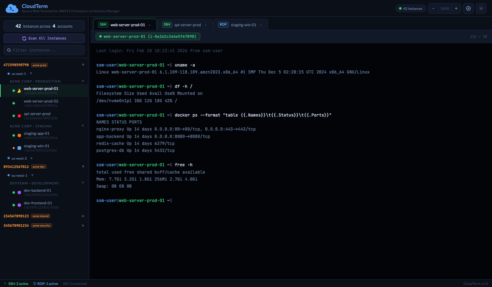

# CloudTerm

A secure, web-based terminal and RDP client for managing AWS EC2 instances via Systems Manager (SSM). Access your fleet from a browser — no SSH keys, no bastion hosts, no open ports.



## Features

### Multi-Account Instance Discovery
- Auto-discovers EC2 instances across multiple AWS profiles and regions concurrently
- Hierarchical sidebar: **Account > Region > Tag Group > Instance**
- Collapsible tree with inline search/filter
- Caches results to YAML with configurable TTL (default 30 min)
- Per-region refresh and full fleet re-scan from the UI

### SSH Terminal (Linux/macOS instances)
- Interactive terminal sessions via `aws ssm start-session` — no SSH keys needed
- Full xterm.js emulation with resize, scroll, Ctrl+C interrupt
- Multiple concurrent sessions as tabbed panels
- Zoom controls and configurable terminal font size
- Multiple terminal color themes (GitHub Dark, Nord, Dracula, Monokai, Catppuccin, Warp, etc.)

### RDP (Windows instances)
- Browser-based RDP via Apache Guacamole integration
- SSM port forwarding — no public IPs or open RDP ports required
- Resolution selector and fullscreen mode
- Clipboard sync between local and remote
- Mac Cmd-to-Ctrl key remapping (Cmd+C/V/A work as Ctrl+C/V/A in Windows)
- Auto-reconnect on transient connection drops with exponential backoff
- RDP sessions appear as tabs alongside SSH sessions

### File Transfer
- **Upload** files to instances (drag-and-drop or file picker, no size limit)
- **Download** files from instances (no size limit)
- Supports both Linux (bash) and Windows (PowerShell)
- Real-time progress via NDJSON streaming in a non-blocking Transfer Manager panel
- Transfers use SSM SendCommand — no S3 buckets or agents needed
- **Transfer Manager**: Google Drive-style progress panel in the bottom-right corner — modals close immediately and transfers run in the background with stacked progress rows

### Express Transfer (S3)
- **Express Upload**: Local → S3 → EC2 instance via presigned GET URL
- **Express Download**: EC2 instance → S3 → Local via presigned PUT URL
- Significantly faster than SSM-based chunking for large files
- EC2 instances download/upload using `curl` (Linux) or `Invoke-WebRequest` (Windows) — no AWS CLI needed
- S3 bucket name configurable in Settings (persisted in browser localStorage)
- Express Download button also available in the File Browser alongside the regular download
- S3 objects are deleted immediately after transfer completes

### Remote File Browser
- Visual directory navigator for remote instances
- Breadcrumb path navigation with click-to-navigate
- Lists files with size, permissions, and modification time
- Click a folder to browse into it, click a file to download
- Regular and Express Download buttons per file (express shown when S3 is configured)
- Upload to the currently browsed directory
- Works on both Linux and Windows instances

### Broadcast Commands
- Run the same command across multiple instances simultaneously
- Instance selection with search/filter and Select All / Deselect All
- Concurrent SSM execution with semaphore (limit 10 parallel)
- Per-instance results with success/error badges and output display
- Accessible from the toolbar or the instance context menu

### Saved Command Snippets
- Quick-access library of reusable commands
- Seeded with common defaults (df, free, top, uptime, ss, systemctl)
- Add, edit, delete, and organize custom snippets
- One-click insert into the active SSH terminal
- Export/import as JSON for sharing across setups

### Session History & Audit Log
- Tracks all session activity: SSH start/stop, RDP connections, file transfers, broadcasts
- JSON-lines format (`audit.log`) for easy parsing
- History modal with searchable, paginated event list
- Each event shows action, instance, timestamp, and details

### Instance Quick Metrics
- CPU load and core count
- Memory usage (used/total with percentage)
- Disk usage (used/total with percentage)
- System uptime
- Color-coded gauge bars (green < 70%, orange 70-90%, red > 90%)
- Works on both Linux and Windows

### Favorites / Pinned Instances
- Star frequently-used instances for quick access
- Dedicated favorites section at the top of the sidebar
- One-click to connect, persisted across sessions
- Toggle from the context menu or directly in the sidebar

### Fleet Summary
- Dashboard showing total/running/stopped counts per account
- Platform breakdown (Amazon Linux, RHEL, Ubuntu, Windows, SUSE)
- Scan duration tracking

### Instance Details
- Right-click context menu on any instance
- Detailed view: name, ID, IPs, state, platform, instance type, AMI ID, IAM instance profile, launch time, and all tags


### Settings
- **App Font Size**: Scale the entire UI (70%–150%), persisted across sessions
- **S3 Bucket**: Configure the S3 bucket name for Express Transfers
- Accessible via the gear icon in the topbar

### UI Themes
- **App themes**: Dark (default), Nord, Dracula, Cyberpunk, Warp Hero, Light
- **Terminal themes**: GitHub Dark, Atom One Dark, Nord, Dracula, Solarized Dark, Monokai, Catppuccin Mocha, Warp

## Architecture

```
+---------------------------------------------------------+
|                       Browser                           |
|   xterm.js terminals | Guacamole RDP | File I/O        |
+----------+-----------+-------+-------+------+-----------+
           | WebSocket         | WebSocket     | HTTP
           v                   v               v
+--------------------+  +--------------+  +--------------+
|  CloudTerm (Go)    |  |  guac-lite   |  |  CloudTerm   |
|  Port 5000         |  |  (Node.js)   |  |  /upload     |
|                    |  |  Port 8080   |  |  /download   |
|  - EC2 Discovery   |  +------+-------+  +--------------+
|  - SSM Sessions    |         |
|  - File Transfer   |         v
|  - Broadcast       |  +--------------+
|  - Audit Log       |  |    guacd     |
|  - REST API        |  |  Port 4822   |
+--------+-----------+  +--------------+
         |
         v
+--------------------+
|  SSM Forwarder     |
|  (Go) Port 5001    |
|  - RDP tunnels     |
|  - Port allocation |
+--------------------+
         |
         v
    AWS SSM / EC2
```

**Services:**

| Service | Role | Base Image |
|---------|------|------------|
| `cloudterm` | Main web app, terminal sessions, API | amazonlinux:2023 + AWS CLI |
| `ssm-forwarder` | RDP port forwarding via SSM + socat | amazonlinux:2023 + AWS CLI |
| `guac-lite` | Guacamole WebSocket proxy | Node.js 18 Alpine |
| `guacd` | Apache Guacamole daemon | guacamole/guacd |

## Prerequisites

- **Docker** and **Docker Compose**
- **AWS credentials** configured in `~/.aws/` (profiles with `credentials` and/or `config`)
- EC2 instances must have the **SSM Agent** installed and an appropriate **IAM instance profile**

## Quick Start

```bash
# Clone the repository
git clone https://github.com/subbareddyalamur/cloudterm.git
cd cloudterm

# Start all services
docker compose up -d

# Open in browser
open http://localhost:5000
```

CloudTerm automatically discovers instances across all configured AWS profiles on startup.

## Configuration

All configuration is via environment variables (set in `docker-compose.yml` or shell):

| Variable | Default | Description |
|----------|---------|-------------|
| `PORT` | `5000` | Web server port |
| `TAG1` | `App` | Primary tag for grouping instances in sidebar |
| `TAG2` | `Environment` | Secondary tag for grouping instances |
| `RDP_MODE` | `native` | RDP mode: `native` (local client) or `guacamole` (browser) |
| `GUAC_WS_URL` | `ws://localhost:8080` | Guacamole WebSocket URL |
| `GUAC_CRYPT_SECRET` | — | 32-byte AES key for Guacamole token encryption |
| `SSM_FORWARDER_HOST` | `ssm-forwarder` | Forwarder service hostname |
| `SSM_FORWARDER_PORT` | `5001` | Forwarder service port |
| `INSTANCES_FILE` | `instances_list.yaml` | Cached instance data filename |
| `CACHE_TTL_SECONDS` | `1800` | Instance cache TTL (seconds) |
| `PORT_RANGE_START` | `33890` | Start of dynamic port range for RDP tunnels |
| `PORT_RANGE_END` | `33999` | End of dynamic port range |
| `AUDIT_LOG_FILE` | `audit.log` | Audit log filename |
| `PREFERENCES_FILE` | `preferences.json` | User preferences filename |
| `DEBUG` | `false` | Enable debug logging |

## Project Structure

```
cloudterm/
├── cmd/
│   ├── cloudterm/main.go              # Main app entry point
│   └── forwarder/main.go             # RDP forwarder entry point
├── internal/
│   ├── audit/logger.go               # Session audit logging (JSON lines)
│   ├── aws/
│   │   ├── discovery.go              # EC2 discovery, scanning, caching
│   │   ├── filetransfer.go           # File upload/download via SSM
│   │   ├── s3transfer.go             # Express file transfer via S3 presigned URLs
│   │   ├── filebrowser.go            # Remote directory browsing via SSM
│   │   ├── broadcast.go              # Multi-instance command execution
│   │   └── metrics.go                # Instance CPU/memory/disk metrics
│   ├── config/config.go              # Environment variable config
│   ├── guacamole/token.go            # Guacamole token encryption (AES-256-CBC)
│   ├── handlers/handlers.go          # HTTP + WebSocket handlers
│   ├── session/manager.go            # Terminal session lifecycle (PTY)
│   └── types/types.go                # Shared data structures
├── web/
│   ├── static/
│   │   ├── js/app.js                 # Frontend application
│   │   └── vendor/                   # xterm.js, guacamole-common.js
│   └── templates/
│       ├── index.html                # Main UI
│       └── rdp-client.html           # RDP client page
├── docker/
│   └── guac-lite/                    # Guacamole-Lite server (Node.js)
├── Dockerfile                        # Main app container
├── Dockerfile.forwarder              # Forwarder container
└── docker-compose.yml                # Full stack orchestration
```

## AWS Services Used

| Service | Purpose |
|---------|---------|
| **EC2** | `DescribeInstances` for discovery |
| **SSM** | `StartSession` for terminals, `SendCommand` for file transfer, broadcast, and metrics |
| **S3** | `PutObject`, `GetObject`, `DeleteObject` for Express Transfers (optional, only when S3 bucket is configured) |
| **STS** | `GetCallerIdentity` for account ID resolution |
| **IAM** | `ListAccountAliases` for account alias lookup |

## Required IAM Permissions

The AWS profiles used by CloudTerm need the following permissions:

```json
{
  "Version": "2012-10-17",
  "Statement": [
    {
      "Effect": "Allow",
      "Action": [
        "ec2:DescribeInstances",
        "ec2:DescribeRegions",
        "ssm:StartSession",
        "ssm:TerminateSession",
        "ssm:SendCommand",
        "ssm:GetCommandInvocation",
        "sts:GetCallerIdentity",
        "iam:ListAccountAliases",
        "s3:PutObject",
        "s3:GetObject",
        "s3:DeleteObject"
      ],
      "Resource": "*"
    }
  ]
}

> **Note:** S3 permissions are only required if you use Express Transfers. You can scope the S3 actions to a specific bucket ARN (e.g., `arn:aws:s3:::my-transfer-bucket/*`).
```

EC2 instances must have an IAM instance profile with the `AmazonSSMManagedInstanceCore` managed policy (or equivalent).

## Tech Stack

- **Backend**: Go 1.24, AWS SDK v2, Gorilla WebSocket, creack/pty
- **Frontend**: Vanilla JS, xterm.js, guacamole-common.js
- **Containers**: Docker with multi-stage builds on amazonlinux:2023
- **RDP Proxy**: Apache Guacamole (guacd + guacamole-lite)

## Security

- All instance access goes through AWS SSM — no SSH keys, no open ports
- AWS credentials are mounted read-only from the host
- Guacamole RDP tokens are encrypted with AES-256-CBC
- File transfers are chunked via SSM with timeouts that scale with file size
- Each terminal session runs in an isolated PTY with its own process group
- All actions are logged to an append-only audit log

## License

MIT